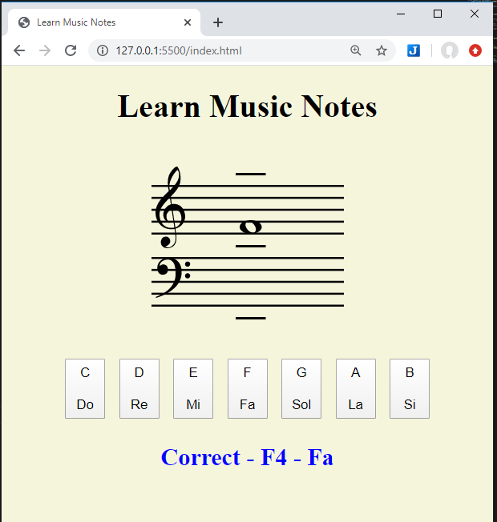

# Learn music notes – Javascript WebApp

This webApp will help you to read music scores.

## Description
This is a simple webApp made in Javascript to run inside a browsers web page and it will help you to learn to identify each musical note in the staff.  With it you will learn almost all notes of the most important 4 octaves. If you train with this app with same regularity, in a short time, you will able to identify and read the notes on the staff at a fast pace.  
The principal technique used in this App is the fact that you can stack div’s tag’s containing image objects inside them. An outer boundary div is created and then inner div’s with absolute position inside them are stacked. The images are all SVG’s (Scaled Vector Graphics).   

## Screen shoot image 

## Music score SVG images
All the music score SVG images used on this webApp have a Creative Commons license and they were obtained from the following Wikipedia page.  
[Wikipedia Category:Musical score components](https://commons.wikimedia.org/wiki/Category:Musical_score_components)

## License
MIT Open Source except the SVG images that have their own license. 

## Have fun!
Best regards,  
Joao Nuno Carvalho  

